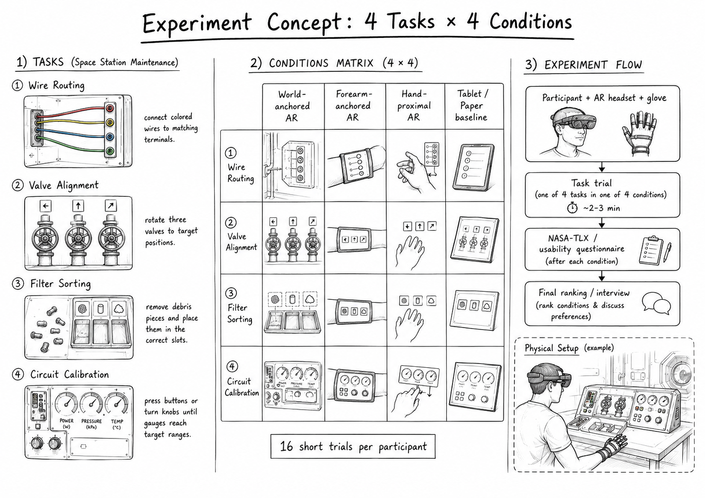
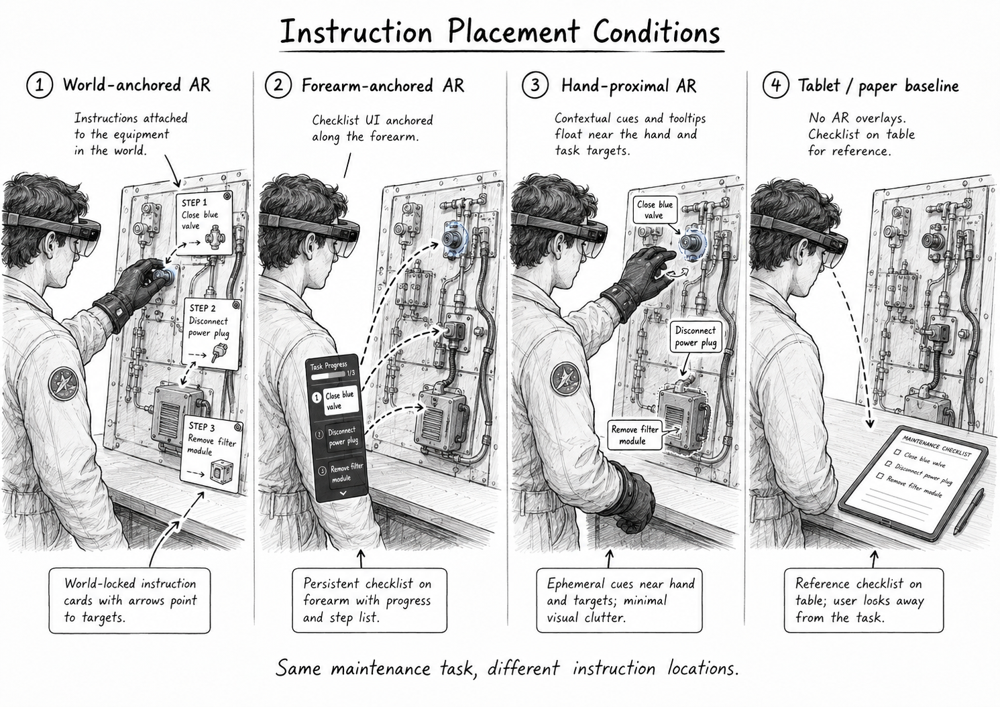

# HandHUD: Forearm-Anchored AR Instructions for Gloved Space Maintenance

**HandHUD** is a mixed-reality research prototype for studying how different AR instruction placements affect task performance, cognitive load, and usability during gloved space-maintenance tasks.

The project explores a simple question:

> When users perform hand-intensive maintenance tasks while wearing astronaut-like constraint gloves, where should AR instructions appear?

We compare four instruction placement conditions:

1. **World-anchored AR** — instructions appear directly on or near the physical task board.
2. **Forearm-anchored AR** — a checklist-style interface is anchored to the user’s forearm.
3. **Hand-proximal AR** — small contextual cues appear near the active hand, fingers, or target object.
4. **Tablet / paper baseline** — instructions are shown on a physical tablet or printed checklist.

The project is designed as a quick, focused study for **SPACE CHI 5.0**, combining human-drone / human-robot interaction interests, XR/AR interfaces, gloved interaction, and space-maintenance scenarios.

---

## Project Goals

This repository supports the design, prototyping, and evaluation of **AR instruction placement for space-maintenance tasks**.

The main goals are to:

- Build a low-cost mixed-reality maintenance taskboard.
- Simulate astronaut-like hand constraints using EVA-inspired gloves.
- Implement four instruction placement conditions in AR and baseline formats.
- Evaluate how instruction placement affects:
  - task completion time,
  - task errors,
  - perceived cognitive load,
  - usability,
  - perceived comfort,
  - preference and qualitative feedback.

---

## Study Motivation

Space-maintenance work often involves constrained movement, bulky gloves, limited tactile feedback, and high cognitive demands. Future astronauts may rely on AR systems to guide inspection, repair, assembly, and calibration tasks inside spacecraft, lunar habitats, or planetary surface stations.

However, it is still unclear where AR instructions should be placed when the user’s hands are occupied.

Should instructions appear:

- directly on the equipment?
- on the user’s forearm like a wearable checklist?
- near the hand as contextual cues?
- or on a separate tablet/paper reference?

This study investigates these alternatives using a controlled mixed-reality maintenance task setup.

---

## Research Questions

Example research questions:

1. **RQ1:** How does AR instruction placement affect performance in gloved maintenance tasks?
2. **RQ2:** How does AR instruction placement affect perceived workload and usability?
3. **RQ3:** Which instruction placement do users prefer for different types of maintenance tasks?
4. **RQ4:** What design recommendations emerge for AR guidance in space-maintenance scenarios?

---

## Experimental Conditions





| Code | Condition | Description |
|---|---|---|
| `W` | World-anchored AR | Instructions are attached to the equipment panel and point directly to target components. |
| `F` | Forearm-anchored AR | Instructions appear as a checklist anchored to the user’s forearm. |
| `H` | Hand-proximal AR | Short cues, labels, and highlights appear near the active hand or target object. |
| `T` | Tablet / paper baseline | Instructions are shown on a nearby tablet or printed checklist. |

---

## Maintenance Tasks

The study uses four short maintenance-inspired tasks. Each task should be completable in approximately **2–3 minutes**.

| Code | Task | Description |
|---|---|---|
| `T1` | Wire Routing | Connect colored wires to matching terminals. |
| `T2` | Valve Alignment | Rotate valves to match target orientations. |
| `T3` | Filter Sorting | Remove debris pieces and place them in correct slots. |
| `T4` | Circuit Calibration | Press buttons or rotate knobs until gauges reach target ranges. |

These tasks are inspired by common “maintenance mini-task” structures but are framed as generic spacecraft or habitat maintenance procedures.

---

## Study Design

The recommended design is a **within-subjects blocked design**.

Each participant experiences all four instruction conditions. Within each condition block, the participant completes all four tasks.

```text
Participant
├── Block 1: Condition A
│   ├── Task 1
│   ├── Task 2
│   ├── Task 3
│   └── Task 4
├── Block 2: Condition B
│   ├── Task 1
│   ├── Task 2
│   ├── Task 3
│   └── Task 4
├── Block 3: Condition C
│   ├── Task 1
│   ├── Task 2
│   ├── Task 3
│   └── Task 4
└── Block 4: Condition D
    ├── Task 1
    ├── Task 2
    ├── Task 3
    └── Task 4
```

The condition order should be counterbalanced using a balanced Latin square or Williams design.

---

## Measures

### Per Task

Collected after or during each individual task trial:

- task completion time,
- number of errors,
- number of hints or assistance requests,
- failed interactions,
- optional single-item mental effort rating.

### Per Condition Block

Collected after each condition block:

- NASA-TLX or Raw TLX,
- System Usability Scale (SUS),
- comfort rating,
- perceived helpfulness,
- perceived distraction,
- perceived suitability for gloved maintenance.

### End of Study

Collected after all four blocks:

- condition ranking,
- semi-structured interview,
- open-ended comments,
- perceived advantages and disadvantages of each interface.

---

## Hardware

Recommended hardware:

- Meta Quest 3 or similar passthrough MR headset,
- physical maintenance taskboard,
- EVA-inspired constraint glove,
- forearm cuff for AR anchoring,
- optional wrist marker / fiducial marker,
- tablet or printed checklist for baseline condition,
- headphones or earbuds for helmet audio simulation.

---

## EVA-Inspired Constraint Glove

Participants wear an EVA-inspired glove to simulate reduced dexterity, reduced tactile feedback, fingertip bulk, and wrist restriction.

The glove is not intended to replicate a real pressurized EVA glove. Instead, it introduces controlled hand constraints relevant to maintenance tasks.

Recommended glove features:

- padded white or gray work glove,
- removable fingertip bulkers,
- elastic finger-flexion resistance,
- wrist restriction cuff,
- forearm display zone,
- high-contrast tracking markers.

For detailed glove construction instructions, see:

```text
EVA_CONSTRAINT_GLOVES_README.md
```

---

## Helmet Simulation

The project uses the Quest 3 as a passthrough AR headset. To make the experience feel more like helmet-mediated space work, the prototype may include:

- semi-transparent visor overlay,
- subtle vignette or helmet border,
- suit-status HUD elements,
- breathing or ventilation audio,
- radio click sounds,
- lightweight shoulder or neck collar.

Do not enclose or modify the Quest 3 headset in a way that blocks cameras, vents, sensors, or straps.

---

## Suggested Repository Structure

```text
handhud-space-maintenance/
├── README.md
├── EVA_CONSTRAINT_GLOVES_README.md
├── docs/
│   ├── study_protocol.md
│   ├── task_descriptions.md
│   ├── condition_descriptions.md
│   ├── consent_script.md
│   └── interview_guide.md
├── counterbalancing/
│   ├── spacechi_blocked_counterbalancing.csv
│   └── latin_square_notes.md
├── unity/
│   ├── Assets/
│   ├── Packages/
│   └── ProjectSettings/
├── taskboard/
│   ├── wiring_task/
│   ├── valve_task/
│   ├── filter_task/
│   └── circuit_task/
├── data/
│   ├── raw/
│   ├── processed/
│   └── README.md
├── analysis/
│   ├── notebooks/
│   ├── scripts/
│   └── figures/
└── media/
    ├── sketches/
    ├── photos/
    └── demo_videos/
```

---

## Setup Guide

### 1. Build the Taskboard

Create a tabletop maintenance panel with four modular task areas:

- wire terminals,
- valves,
- sorting bins,
- buttons, knobs, and gauges.

The taskboard should be sturdy enough for repeated use and should allow the same tasks to be performed across all instruction conditions.

### 2. Prepare the Glove

Build and test the EVA-inspired constraint glove.

Check that participants can still:

- press buttons,
- rotate knobs,
- grip valves,
- pick up small objects,
- insert wires.

The glove should make tasks harder but not impossible.

### 3. Implement AR Conditions

Implement the three AR conditions:

- world-anchored instruction cards,
- forearm checklist,
- hand-proximal cues.

The tablet or paper baseline does not require AR overlays.

### 4. Prepare Counterbalancing

Use the blocked counterbalancing CSV to assign each participant a condition order and task order.

### 5. Pilot the Study

Before formal data collection, run at least 2–3 pilot participants to check:

- task difficulty,
- tracking reliability,
- questionnaire length,
- comfort,
- session duration,
- whether the AR overlays are readable.

---

## Data Collection Flow

Recommended session flow:

```text
Consent and briefing
↓
Headset and glove fitting
↓
Practice task
↓
Condition Block 1
↓
NASA-TLX + SUS
↓
Condition Block 2
↓
NASA-TLX + SUS
↓
Condition Block 3
↓
NASA-TLX + SUS
↓
Condition Block 4
↓
NASA-TLX + SUS
↓
Final ranking and interview
```

---

## Data Logging Template

Recommended trial-level fields:

| Field | Description |
|---|---|
| `participant_id` | Anonymous participant code |
| `block_number` | Condition block number |
| `condition_code` | `W`, `F`, `H`, or `T` |
| `condition_name` | Full condition name |
| `task_code` | `T1`, `T2`, `T3`, or `T4` |
| `task_name` | Full task name |
| `trial_number` | Overall trial index |
| `completion_time_sec` | Time to complete task |
| `errors` | Number of task errors |
| `hints_requested` | Number of hints or help requests |
| `notes` | Observer notes |

Recommended condition-level fields:

| Field | Description |
|---|---|
| `participant_id` | Anonymous participant code |
| `block_number` | Condition block number |
| `condition_code` | `W`, `F`, `H`, or `T` |
| `nasa_tlx_score` | Workload score |
| `sus_score` | Usability score |
| `comfort_score` | Comfort rating |
| `helpfulness_score` | Perceived helpfulness |
| `preference_notes` | Participant comments |

---

## Analysis Plan

Possible analyses:

- compare task completion time across conditions,
- compare error rates across conditions,
- compare NASA-TLX scores across conditions,
- compare SUS scores across conditions,
- inspect condition × task interaction patterns,
- analyze final rankings,
- code interview responses into design themes.

Since this is likely a small study, report descriptive statistics, effect sizes, confidence intervals, and qualitative patterns rather than relying only on statistical significance.

---

## Expected Contributions

This project aims to contribute:

1. A low-cost mixed-reality testbed for gloved space-maintenance tasks.
2. A comparison of four instruction placement strategies.
3. Empirical findings on performance, workload, usability, and preference.
4. Design recommendations for AR procedural guidance in space-maintenance contexts.
5. Practical lessons for building EVA-inspired glove and helmet simulations for HCI studies.

---

## Suggested Paper Framing

Possible title:

> **HandHUD: Comparing AR Instruction Placement for Gloved Space-Maintenance Tasks**

Alternative titles:

- **Forearm or World? Comparing AR Guidance Locations for Gloved Space Maintenance**
- **Where Should Space-Maintenance Instructions Appear? A Mixed-Reality Study of Gloved Interaction**
- **HandHUD: Forearm-Anchored AR Guidance for Helmet-Mediated Maintenance Work**

Short abstract seed:

> Future space-maintenance work may require astronauts to perform complex procedures while wearing bulky gloves and interacting with mixed-reality guidance systems. However, it remains unclear where AR instructions should appear when the user’s hands are occupied. We present HandHUD, a mixed-reality prototype for comparing world-anchored, forearm-anchored, hand-proximal, and tablet-based procedural guidance during gloved maintenance tasks. In a within-subjects study, participants complete four maintenance-inspired tasks while wearing an EVA-inspired constraint glove. We measure task performance, errors, workload, usability, and user preference. Our findings inform the design of AR guidance systems for constrained, hand-intensive work in space habitats and other extreme environments.

---

## Safety Notes

- Do not build a sealed helmet around the Quest 3.
- Do not block headset cameras, sensors, vents, or straps.
- Keep the participant’s physical workspace clear.
- Ensure the participant can remove the glove quickly.
- Avoid finger constraints that lock the hand closed.
- Monitor discomfort, fatigue, and simulator sickness.
- Allow participants to stop at any time.

---

## Status

Current project stage:

- [x] Project concept defined
- [x] Experimental conditions selected
- [x] Maintenance tasks selected
- [x] Blocked counterbalancing prepared
- [x] EVA glove guide drafted
- [ ] Taskboard materials acquired
- [ ] AR prototype implemented
- [ ] Pilot study conducted
- [ ] Formal study conducted
- [ ] Data analysis completed
- [ ] SPACE CHI paper written

---

## Citation

If you use or adapt this project, please cite the corresponding paper or project repository once available.

```bibtex
@misc{handhud_spacechi,
  title = {HandHUD: Forearm-Anchored AR Instructions for Gloved Space Maintenance},
  author = {Project Authors},
  year = {2026},
  note = {Research prototype for SPACE CHI 5.0}
}
```

---

## License

Add your chosen license here, for example:

- MIT License for code,
- CC BY 4.0 for documentation and study materials,
- separate license for media assets if needed.
